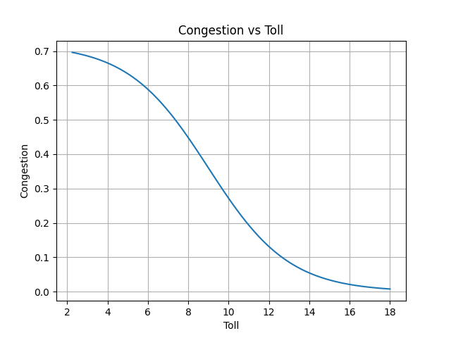

## Modeling Toll Pricing for Congestion Management

**Objective**

The goal of the congestion model is to determine optimal congestion tolls for each entry point into the Manhattan Central Business District that are dynamically adjusted, both:
- Locally: at the specific entry point, and
- Globally: across the entire Central Residential Zone (CRZ)

The model is designed to set the lowest tolls possible while maintaining congestion below a defined threshold (e.g., 0.3). This ensures traffic flow and accessibility without unnecessarily overpricing entry.

**What Is the Congestion Score?**

Congestion score is defined as follows:
```math
\text{congestion} = 1 - \frac{\text{currentFlowRate}}{\text{freeFlowRate}}
```
where the current flow rate and free flow rate (of traffic) are pulled from a real-time traffic API (TomTom). Therefore
- 0.0 = completely free-flowing traffic
- 1.0 = total gridlock

Global congestion is measured as the average of sampled CRZ locations. Local congestion is computed per-entry-point. 

**Modeling Approach**

We used differentiable supervised learning model trained on simulated data that mimics driver responses to toll levels.

Key Components
- Multilayer Perceptron (MLP): A feedforward neural network that takes inputs (local_congestion, global_congestion) and outputs a predicted toll.
- Differentiable Congestion Model: A fixed simulation function that predicts congestion given tolls, designed to allow gradients to flow back through toll decisions.
- Custom Loss Function:
```math
\text{Loss} = \text{Mean(Tolls)} + \lambda \cdot \max(0, \text{congestion} - \text{threshold})^2
```

We tuned:
- λ = 1e6 (penalty weight)
- threshold = 0.3

This incentivizes setting the lowest possible tolls while avoiding excess congestion.

**Toll Response Congestion Modeling**

Economic theory and empirical studies show that demand for urban travel is price elastic, meaning that as tolls rise, fewer vehicles enter, reducing congestion. The relationship is nonlinear, especially near behavioral tipping points.
We used a differentiable sigmoid-like function to model this shape:
```math
\text{congestion} = \frac{\text{base}}{1 + \exp(k \cdot (\text{toll} - \theta))}
```

Where:
- base is the max congestion if tolls are free.
- θ is the inflection point. 
- k controls steepness.

This produces the characteristic S-curve shown below:



This functional form is backed by empirical elasticity studies (e.g., Small & Verhoef, The Economics of Urban Transportation, 2007, etc). 

**Training Setup**
- Training Data: 10,000 random samples of (local_congestion, global_congestion) ∈ [0, 1]
- Target: Find tolls that minimize the loss while keeping predicted congestion under a threshold (e.g., 0.3)
- Penalty Weight: λ = 1,000,000
- Toll Range: Learned model outputs are mapped via tanh to a [2.25, 18] dollar range

The congestion model is fixed and does not learn — it merely simulates driver behavior in response to tolling.